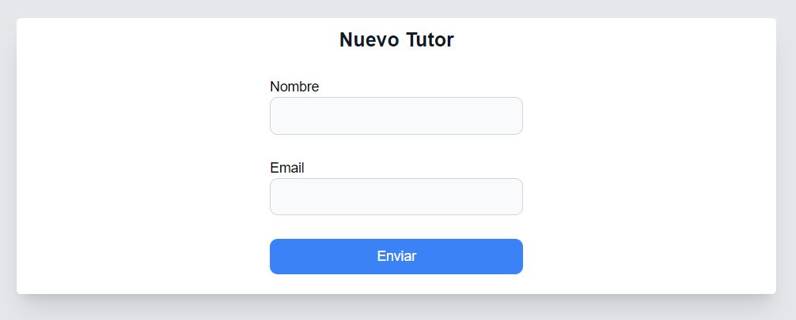

<p align="center"></p>

## Proyecto Tutorías

Este será el respositorio para el proyecto. Aquí encontraras la <a href="doc">documentación</a> y los pasos para la instalación.

### Instalación de dependencias

- El primer paso es descargar <a href="https://nodejs.org/es/" target="_blank">Node js</a>.
- Clona el respositorio o descarga el archivo que envié al grupo
- Accede con la terminal a la carpeta donde hayas descomprimido el archivo
- Ejectuta el siguiente comando

```
$ npm install
```
Esto instalará las dependencias.

### Base de datos

Para que la base de datos funcione en el ambiente de prueba es necesario crear la carpeta `db`. Sólo la carpeta y nada más.

En el ambiente de producción la base de datos se crea sola, no es necesario hacer nada.

### Correr la app en ambiente de prueba

```
$ npm run dev
```

### Compilar la app (producción)

```
# Para 64-bits
$ npm run build:win64

# Para 32-bits
$ npm run build:win32

# Para Linux
$ npm run build:linux
```
Esto creará una carpeta llamada `dist`, dentro de ella se encontrará un instalador y una carpeta que contiene la aplicación en formato portable. Recomiendo ejecutar el portable
